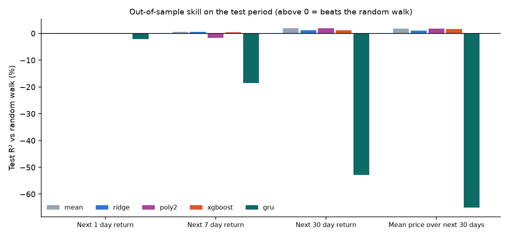
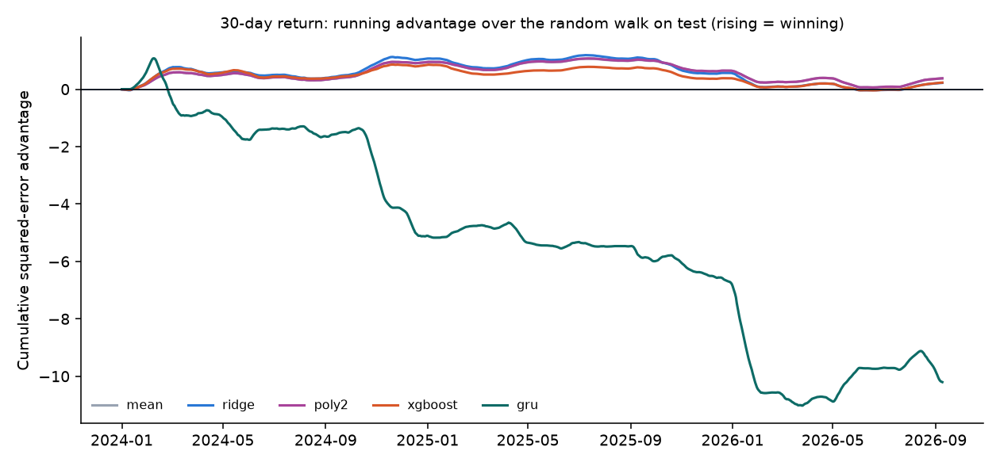

# Bitcoin model comparison: train, validate, test

Run: 2026-10-10 09:06 UTC · data collected 2026-10-10T08:45:38+00:00 · 47 of 48 series loaded · price base `btc` · runtime 14.7 min

**How to read this.** R²oos compares each model with the random-walk forecast (tomorrow's price = today's). 0 means no better than the random walk, negative means worse. The Diebold-Mariano p-value (DM p) tests whether a model beats the random walk by more than chance. A model should also beat the constant-drift forecast (the average past return, row `mean`). The overfit gap is in-sample R²oos minus test R²oos.

## Split

| Block | Period | Used for |
|---|---|---|
| Train | 2018-03-01 to 2022-12-31 | fitting |
| Validation | 2023-01-01 to 2023-12-31 | choosing hyperparameters and early stopping |
| Test | 2024-01-01 to latest | scored once, after refitting on train + validation |

## Next 1 day return (`r1`, 1 d)

Rows: train 1766, validation 365, test 1012 (2024-01-01 to 2026-10-08) · 189 features

| Model | Train R²oos | Val R²oos | Test R²oos | Test direction hit | Test DM p | Overfit gap | Half-years beating RW |
|---|---|---|---|---|---|---|---|
| zero | +0.00% | +0.00% | **+0.00%** | – | – | +0.00% | 0/6 |
| mean | +0.00% | +0.23% | **+0.06%** | 0.502 | 0.690 | -0.03% | 4/6 |
| ridge | +0.48% | -0.21% | **+0.06%** | 0.504 | 0.802 | +0.43% | 4/6 |
| poly2 | +0.07% | +0.23% | **+0.08%** | 0.502 | 0.626 | +0.04% | 4/6 |
| xgboost | +4.83% | +0.45% | **-0.14%** | 0.502 | 0.725 | +4.92% | 3/6 |
| ridge_fixed | +17.52% | -80.88% | **-153.22%** | 0.526 | 0.000 | +168.32% | 0/6 |
| poly2_fixed | +17.39% | -82.82% | **-27.31%** | 0.487 | 0.000 | +44.47% | 0/6 |
| xgb_fixed | +46.41% | -13.99% | **-2.92%** | 0.497 | 0.147 | +45.29% | 1/6 |
| gru | +1.68% | +0.37% | **-2.21%** | 0.513 | 0.038 | +5.77% | 1/6 |
| gru_fixed | +33.87% | -47.41% | **-40.34%** | 0.503 | 0.000 | +74.98% | 0/6 |

Ranking on test with overfitting flags:

- **poly2**: test R²oos +0.08%, DM p vs random walk 0.626, vs drift 0.092 · no risk flags
- **ridge**: test R²oos +0.06%, DM p vs random walk 0.802, vs drift 0.961 · risk: no better than the constant-drift forecast
- **xgboost**: test R²oos -0.14%, DM p vs random walk 0.725, vs drift 0.503 · risk: no better than the constant-drift forecast
- **gru**: test R²oos -2.21%, DM p vs random walk 0.038, vs drift 0.021 · risk: large in-sample vs test gap, loses to random walk in most half-years, no better than the constant-drift forecast

**Verdict:** no model beats both the random walk and the constant drift significantly without an overfitting flag.

Overfitting probes (fixed settings, no validation brake): ridge_fixed in-sample +15.1% → test -153.2%; poly2_fixed in-sample +17.2% → test -27.3%; xgb_fixed in-sample +42.4% → test -2.9%; gru_fixed in-sample +34.6% → test -40.3%

GRU test R²oos by seed: -2.67%, -2.62%, -2.78%, -2.39%, -2.59%

## Next 7 day return (`r7`, 7 d)

Rows: train 1760, validation 365, test 1006 (2024-01-01 to 2026-10-02) · 189 features

| Model | Train R²oos | Val R²oos | Test R²oos | Test direction hit | Test DM p | Overfit gap | Half-years beating RW |
|---|---|---|---|---|---|---|---|
| zero | +0.00% | +0.00% | **+0.00%** | – | – | +0.00% | 0/6 |
| mean | +0.03% | +1.24% | **+0.51%** | 0.530 | 0.608 | -0.29% | 4/6 |
| ridge | +2.39% | -0.89% | **+0.59%** | 0.527 | 0.649 | +1.80% | 4/6 |
| poly2 | +14.19% | +2.26% | **-1.75%** | 0.508 | 0.316 | +16.43% | 2/6 |
| xgboost | +0.80% | +1.57% | **+0.42%** | 0.530 | 0.676 | +0.43% | 3/6 |
| ridge_fixed | +56.90% | -139.09% | **-585.20%** | 0.516 | 0.000 | +636.23% | 0/6 |
| poly2_fixed | +45.00% | -66.36% | **-69.29%** | 0.480 | 0.000 | +110.64% | 0/6 |
| xgb_fixed | +80.79% | -88.43% | **-14.66%** | 0.530 | 0.005 | +90.84% | 2/6 |
| gru | +7.49% | +5.11% | **-18.55%** | 0.510 | 0.001 | +43.33% | 0/6 |
| gru_fixed | +90.99% | -251.05% | **-188.95%** | 0.488 | 0.000 | +279.96% | 0/6 |

Ranking on test with overfitting flags:

- **ridge**: test R²oos +0.59%, DM p vs random walk 0.649, vs drift 0.869 · no risk flags
- **xgboost**: test R²oos +0.42%, DM p vs random walk 0.676, vs drift 0.365 · risk: no better than the constant-drift forecast
- **poly2**: test R²oos -1.75%, DM p vs random walk 0.316, vs drift 0.072 · risk: large in-sample vs test gap, loses to random walk in most half-years, no better than the constant-drift forecast
- **gru**: test R²oos -18.55%, DM p vs random walk 0.001, vs drift 0.001 · risk: large in-sample vs test gap, validation result did not hold on test, loses to random walk in most half-years, unstable across seeds, no better than the constant-drift forecast

**Verdict:** no model beats both the random walk and the constant drift significantly without an overfitting flag.

Overfitting probes (fixed settings, no validation brake): ridge_fixed in-sample +51.0% → test -585.2%; poly2_fixed in-sample +41.4% → test -69.3%; xgb_fixed in-sample +76.2% → test -14.7%; gru_fixed in-sample +91.0% → test -189.0%

GRU test R²oos by seed: -20.31%, -18.38%, -17.26%, -25.38%, -20.94%

## Next 30 day return (`r30`, 30 d)

Rows: train 1737, validation 365, test 983 (2024-01-01 to 2026-09-09) · 189 features

| Model | Train R²oos | Val R²oos | Test R²oos | Test direction hit | Test DM p | Overfit gap | Half-years beating RW |
|---|---|---|---|---|---|---|---|
| zero | +0.00% | +0.00% | **+0.00%** | – | – | +0.00% | 0/6 |
| mean | +0.24% | +6.66% | **+1.96%** | 0.561 | 0.673 | -0.85% | 4/6 |
| ridge | +7.34% | -2.41% | **+1.15%** | 0.561 | 0.834 | +6.07% | 4/6 |
| poly2 | +0.68% | +6.59% | **+1.97%** | 0.561 | 0.674 | -0.39% | 4/6 |
| xgboost | +17.05% | +9.59% | **+1.20%** | 0.561 | 0.789 | +16.48% | 3/6 |
| ridge_fixed | +85.51% | -889.79% | **-319.82%** | 0.572 | 0.000 | +400.43% | 0/6 |
| poly2_fixed | +68.81% | -164.04% | **-47.04%** | 0.469 | 0.000 | +106.57% | 0/6 |
| xgb_fixed | +95.43% | -87.24% | **-44.23%** | 0.572 | 0.025 | +138.56% | 1/6 |
| gru | +22.27% | +7.25% | **-52.89%** | 0.616 | 0.020 | +130.16% | 0/6 |
| gru_fixed | +97.48% | -142.83% | **-84.48%** | 0.596 | 0.004 | +181.94% | 0/6 |

Ranking on test with overfitting flags:

- **poly2**: test R²oos +1.97%, DM p vs random walk 0.674, vs drift 0.965 · no risk flags
- **xgboost**: test R²oos +1.20%, DM p vs random walk 0.789, vs drift 0.551 · risk: large in-sample vs test gap, validation result did not hold on test, no better than the constant-drift forecast
- **ridge**: test R²oos +1.15%, DM p vs random walk 0.834, vs drift 0.530 · risk: large in-sample vs test gap, no better than the constant-drift forecast
- **gru**: test R²oos -52.89%, DM p vs random walk 0.020, vs drift 0.019 · risk: large in-sample vs test gap, validation result did not hold on test, loses to random walk in most half-years, unstable across seeds, no better than the constant-drift forecast

**Verdict:** no model beats both the random walk and the constant drift significantly without an overfitting flag.

Overfitting probes (fixed settings, no validation brake): ridge_fixed in-sample +80.6% → test -319.8%; poly2_fixed in-sample +59.5% → test -47.0%; xgb_fixed in-sample +94.3% → test -44.2%; gru_fixed in-sample +97.5% → test -84.5%

GRU test R²oos by seed: -66.29%, -66.19%, -95.25%, -76.61%, -38.73%

## Mean price over next 30 days (drives 50/100/200-day MA forecasts) (`m30`, 30 d)

Rows: train 1737, validation 365, test 983 (2024-01-01 to 2026-09-09) · 189 features

| Model | Train R²oos | Val R²oos | Test R²oos | Test direction hit | Test DM p | Overfit gap | Half-years beating RW |
|---|---|---|---|---|---|---|---|
| zero | +0.00% | +0.00% | **+0.00%** | – | – | +0.00% | 0/6 |
| mean | +0.47% | +8.10% | **+1.72%** | 0.546 | 0.719 | -0.37% | 4/6 |
| ridge | +6.21% | +2.26% | **+1.08%** | 0.546 | 0.843 | +5.33% | 4/6 |
| poly2 | +0.87% | +8.02% | **+1.73%** | 0.546 | 0.717 | +0.05% | 4/6 |
| xgboost | +2.44% | +8.26% | **+1.68%** | 0.546 | 0.736 | +1.26% | 4/6 |
| ridge_fixed | +85.20% | -500.20% | **-368.88%** | 0.585 | 0.000 | +448.63% | 0/6 |
| poly2_fixed | +66.02% | -70.84% | **-47.91%** | 0.466 | 0.000 | +105.57% | 0/6 |
| xgb_fixed | +95.15% | -114.43% | **-44.73%** | 0.551 | 0.026 | +138.03% | 2/6 |
| gru | +17.74% | +9.32% | **-65.10%** | 0.548 | 0.003 | +136.15% | 0/6 |
| gru_fixed | +98.79% | -268.80% | **-133.17%** | 0.537 | 0.001 | +231.95% | 0/6 |

Ranking on test with overfitting flags:

- **poly2**: test R²oos +1.73%, DM p vs random walk 0.717, vs drift 0.658 · risk: validation result did not hold on test
- **xgboost**: test R²oos +1.68%, DM p vs random walk 0.736, vs drift 0.882 · risk: validation result did not hold on test, no better than the constant-drift forecast
- **ridge**: test R²oos +1.08%, DM p vs random walk 0.843, vs drift 0.602 · risk: large in-sample vs test gap, no better than the constant-drift forecast
- **gru**: test R²oos -65.10%, DM p vs random walk 0.003, vs drift 0.004 · risk: large in-sample vs test gap, validation result did not hold on test, loses to random walk in most half-years, unstable across seeds, no better than the constant-drift forecast

**Verdict:** no model beats both the random walk and the constant drift significantly without an overfitting flag.

Overfitting probes (fixed settings, no validation brake): ridge_fixed in-sample +79.7% → test -368.9%; poly2_fixed in-sample +57.7% → test -47.9%; xgb_fixed in-sample +93.3% → test -44.7%; gru_fixed in-sample +98.8% → test -133.2%

GRU test R²oos by seed: -64.33%, -68.44%, -79.52%, -96.31%, -63.08%

## Walk-forward check (refit every 91 days, 2020 onwards)

Each quarter the models are re-tuned on the trailing year and refit on all earlier data, then forecast the next quarter. This tests the same models over about 25 different periods instead of one.

**Next 1 day return** · 25 folds, 2020-09-30 to 2026-10-08

| Model | R²oos | DM p vs random walk | DM p vs drift | 2020 | 2021 | 2022 | 2023 | 2024 | 2025 | 2026 |
|---|---|---|---|---|---|---|---|---|---|---|
| zero | **+0.00%** | – | – | +0.0% | +0.0% | +0.0% | +0.0% | +0.0% | +0.0% | +0.0% |
| mean | **-0.08%** | 0.520 | – | +0.0% | -0.0% | -0.5% | +0.3% | +0.3% | -0.2% | -0.2% |
| ridge | **-0.56%** | 0.212 | 0.257 | +0.6% | -0.7% | -1.0% | -1.2% | +0.3% | -0.6% | -0.3% |
| poly2 | **-0.16%** | 0.749 | 0.858 | +0.2% | +0.8% | -2.0% | -0.3% | -0.2% | -0.3% | +0.8% |
| xgboost | **-0.84%** | 0.218 | 0.244 | -0.5% | -1.4% | -0.5% | -0.7% | -0.0% | -0.9% | -1.2% |

**Next 7 day return** · 25 folds, 2020-09-30 to 2026-10-02

| Model | R²oos | DM p vs random walk | DM p vs drift | 2020 | 2021 | 2022 | 2023 | 2024 | 2025 | 2026 |
|---|---|---|---|---|---|---|---|---|---|---|
| zero | **+0.00%** | – | – | +0.0% | +0.0% | +0.0% | +0.0% | +0.0% | +0.0% | +0.0% |
| mean | **-0.59%** | 0.398 | – | +0.2% | -0.7% | -3.1% | +1.6% | +2.2% | -2.1% | -1.3% |
| ridge | **-2.38%** | 0.074 | 0.174 | +1.8% | -4.5% | -3.7% | -3.7% | +2.7% | -3.3% | -1.9% |
| poly2 | **-4.92%** | 0.014 | 0.025 | -3.2% | -2.8% | -5.6% | -17.8% | -0.4% | -3.0% | -3.1% |
| xgboost | **-6.99%** | 0.014 | 0.019 | +0.5% | -4.7% | -11.8% | -26.4% | +2.8% | -4.4% | -1.4% |

**Next 30 day return** · 24 folds, 2020-09-30 to 2026-09-09

| Model | R²oos | DM p vs random walk | DM p vs drift | 2020 | 2021 | 2022 | 2023 | 2024 | 2025 | 2026 |
|---|---|---|---|---|---|---|---|---|---|---|
| zero | **+0.00%** | – | – | +0.0% | +0.0% | +0.0% | +0.0% | +0.0% | +0.0% | +0.0% |
| mean | **-2.18%** | 0.475 | – | +2.7% | -5.2% | -13.7% | +7.8% | +9.6% | -12.2% | -5.5% |
| ridge | **-16.36%** | 0.031 | 0.048 | +3.7% | -18.3% | -17.0% | -93.2% | +10.6% | -22.6% | -5.8% |
| poly2 | **-14.69%** | 0.032 | 0.036 | +2.9% | -4.5% | -60.0% | -29.4% | +6.8% | -18.8% | -13.8% |
| xgboost | **-20.97%** | 0.035 | 0.028 | +1.0% | -60.3% | -12.5% | -5.0% | +5.6% | -50.7% | -5.4% |

**Mean price over next 30 days (drives 50/100/200-day MA forecasts)** · 24 folds, 2020-09-30 to 2026-09-09

| Model | R²oos | DM p vs random walk | DM p vs drift | 2020 | 2021 | 2022 | 2023 | 2024 | 2025 | 2026 |
|---|---|---|---|---|---|---|---|---|---|---|
| zero | **+0.00%** | – | – | +0.0% | +0.0% | +0.0% | +0.0% | +0.0% | +0.0% | +0.0% |
| mean | **-1.23%** | 0.670 | – | +4.6% | -3.4% | -14.1% | +8.7% | +8.8% | -10.5% | -5.7% |
| ridge | **-7.12%** | 0.152 | 0.151 | +5.9% | -17.3% | -5.5% | -22.2% | +9.3% | -18.7% | -5.8% |
| poly2 | **-8.91%** | 0.058 | 0.038 | +5.0% | -5.5% | -32.5% | -22.7% | +5.3% | -10.8% | -9.4% |
| xgboost | **-17.52%** | 0.091 | 0.066 | +4.3% | -54.5% | -9.3% | -5.0% | +6.9% | -33.2% | -7.6% |

## 50/100/200-day moving averages, 30 days ahead

Forecast = known part of the average + 30 predicted days (from the `m30` model). The naive forecast fills the 30 unknown days with today's price.

| Model | MA50 error | MA100 error | MA200 error | MA50 vs naive | MA100 vs naive | MA200 vs naive |
|---|---|---|---|---|---|---|
| gru | 4.78% | 2.45% | 1.28% | 1.301× | 1.302× | 1.303× |
| gru_fixed | 5.59% | 2.88% | 1.52% | 1.524× | 1.531× | 1.545× |
| mean | 3.70% | 1.89% | 0.99% | 1.008× | 1.005× | 1.006× |
| poly2 | 3.70% | 1.89% | 0.99% | 1.008× | 1.005× | 1.006× |
| poly2_fixed | 4.58% | 2.34% | 1.21% | 1.248× | 1.245× | 1.236× |
| ridge | 3.75% | 1.91% | 1.00% | 1.021× | 1.017× | 1.019× |
| ridge_fixed | 7.98% | 4.10% | 2.16% | 2.173× | 2.177× | 2.197× |
| xgb_fixed | 4.94% | 2.50% | 1.31% | 1.346× | 1.328× | 1.330× |
| xgboost | 3.71% | 1.89% | 0.99% | 1.010× | 1.006× | 1.007× |
| zero | 3.67% | 1.88% | 0.98% | 1.000× | 1.000× | 1.000× |

The naive forecast alone already explains MA50 96.3%, MA100 99.1%, MA200 99.8% of the variation in moving-average levels on test, so high R² on moving averages says nothing about skill.

## XGBoost: most used features (gain, final refit)

- `r1`: fear_greed_chg_7, gpr_threats_chg_7, dxy_ret_30, gpr_lvl, btc_mom_365, reverse_repo_chg_7, wiki_crypto_chg_7, fed_funds_chg_30, cm_issuance_chg_30, btc_mom_7, fear_greed_z365, oil_gap_200
- `r7`: fin_conditions_z365, fin_conditions_lvl, cm_issuance_chg_90, fin_conditions_chg_30, ust2y_chg_30, ust10y_yahoo_lvl, oil_ret_7
- `r30`: fin_conditions_z365, ust10y_lvl, move_z365, ust10y_yahoo_lvl, ust10y_yahoo_z365, fed_funds_lvl, btc_ma_gap_100, cm_mvrv_lvl, breakeven5y_z365, stablecoin_supply_chg_90, fed_balance_sheet_chg_90, funding_rate_lvl
- `m30`: fin_conditions_z365, fed_funds_lvl, ust10y_yahoo_lvl, m2_z365, fin_conditions_lvl

## Data sources

| Series | Source | Kind | Lag (days) | From | To | Status |
|---|---|---|---|---|---|---|
| breakeven5y | FRED (St. Louis Fed) | level | 1 | 2010-01-04 | 2026-10-09 | ok |
| btc | Yahoo Finance | price | 0 | 2014-09-17 | 2026-10-10 | ok |
| btc_volume | Yahoo Finance | count | 0 | 2014-09-17 | 2026-10-10 | ok |
| cm_active_addresses | Coin Metrics community API | count | 1 | 2013-01-01 | 2026-10-09 | ok |
| cm_exchange_inflow | Coin Metrics community API | count | 1 | 2013-01-01 | 2026-10-09 | ok |
| cm_exchange_outflow | Coin Metrics community API | count | 1 | 2013-01-01 | 2026-10-09 | ok |
| cm_exchange_supply | Coin Metrics community API | count | 1 | 2013-01-01 | 2026-10-09 | ok |
| cm_hashrate | Coin Metrics community API | count | 1 | 2013-01-01 | 2026-10-09 | ok |
| cm_issuance | Coin Metrics community API | count | 1 | 2013-01-01 | 2026-10-09 | ok |
| cm_mvrv | Coin Metrics community API | level | 1 | 2013-01-01 | 2026-10-09 | ok |
| cm_price | Coin Metrics community API | price | 1 | 2013-01-01 | 2026-10-09 | ok |
| cm_tx_count | Coin Metrics community API | count | 1 | 2013-01-01 | 2026-10-09 | ok |
| coin | Yahoo Finance | price | 0 | 2021-04-14 | 2026-10-09 | ok |
| curve_10y2y | FRED (St. Louis Fed) | level | 1 | 2010-01-04 | 2026-10-09 | ok |
| dxy | Yahoo Finance | price | 0 | 2013-01-02 | 2026-10-09 | ok |
| emu_us | FRED (St. Louis Fed) | level | 1 | 2010-01-01 | 2026-10-08 | ok |
| epu_us | FRED (St. Louis Fed) | level | 1 | 2010-01-01 | 2026-10-08 | ok |
| eth | Yahoo Finance | price | 0 | 2017-11-09 | 2026-10-10 | ok |
| fear_greed | alternative.me | level | 0 | 2018-02-01 | 2026-10-10 | ok |
| fed_balance_sheet | FRED (St. Louis Fed) | count | 2 | 2010-01-06 | 2026-10-07 | ok |
| fed_funds | FRED (St. Louis Fed) | level | 1 | 2010-01-01 | 2026-10-08 | ok |
| fin_conditions | FRED (St. Louis Fed) | level | 7 | 2010-01-01 | 2026-10-02 | ok |
| funding_rate | BitMEX | level | 0 | 2016-05-14 | 2026-09-16 | ok |
| gold | Yahoo Finance | price | 0 | 2013-01-02 | 2026-10-09 | ok |
| gpr | Caldara & Iacoviello GPR | level | 1 | 2010-01-01 | 2026-10-05 | ok |
| gpr_acts | Caldara & Iacoviello GPR | level | 1 | 2010-01-01 | 2026-10-05 | ok |
| gpr_threats | Caldara & Iacoviello GPR | level | 1 | 2010-01-01 | 2026-10-05 | ok |
| hy_spread | FRED (St. Louis Fed) | level | 1 | 2023-10-10 | 2026-10-08 | ok |
| m2 | FRED (St. Louis Fed) | count | 60 | 2010-01-01 | 2026-08-01 | ok |
| move | Yahoo Finance | level | 0 | 2013-01-02 | 2026-10-09 | ok |
| mstr | Yahoo Finance | price | 0 | 2013-01-02 | 2026-10-09 | ok |
| nasdaq | Yahoo Finance | price | 0 | 2013-01-02 | 2026-10-09 | ok |
| news_tone_bitcoin | GDELT | | | | | failed: RuntimeError: GDELT rate limit persisted |
| news_tone_conflict | GDELT 2.0 DOC API | level | 1 | 2017-01-01 | 2026-10-10 | ok |
| news_tone_macro | GDELT 2.0 DOC API | level | 1 | 2017-01-01 | 2026-10-10 | ok |
| news_volume_bitcoin | GDELT 2.0 DOC API | count | 1 | 2017-01-01 | 2026-10-10 | ok |
| oil | Yahoo Finance | price | 0 | 2013-01-02 | 2026-10-09 | ok |
| reverse_repo | FRED (St. Louis Fed) | count | 1 | 2010-08-12 | 2026-10-09 | ok |
| sp500 | Yahoo Finance | price | 0 | 2013-01-02 | 2026-10-09 | ok |
| stablecoin_supply | DefiLlama | count | 1 | 2017-11-29 | 2026-10-10 | ok |
| treasury_account | FRED (St. Louis Fed) | count | 2 | 2010-01-06 | 2026-10-07 | ok |
| usd_broad | FRED (St. Louis Fed) | price | 1 | 2010-01-04 | 2026-10-02 | ok |
| ust10y | FRED (St. Louis Fed) | level | 1 | 2010-01-04 | 2026-10-08 | ok |
| ust10y_yahoo | Yahoo Finance | level | 0 | 2013-01-02 | 2026-10-09 | ok |
| ust2y | FRED (St. Louis Fed) | level | 1 | 2010-01-04 | 2026-10-08 | ok |
| vix | Yahoo Finance | level | 0 | 2013-01-02 | 2026-10-09 | ok |
| wiki_bitcoin | Wikimedia pageviews | count | 1 | 2015-07-01 | 2026-10-09 | ok |
| wiki_crypto | Wikimedia pageviews | count | 1 | 2015-07-01 | 2026-10-09 | ok |

Lag is the number of days a value is held back before the model may use it, so that only data that was public at the time enters each prediction.
